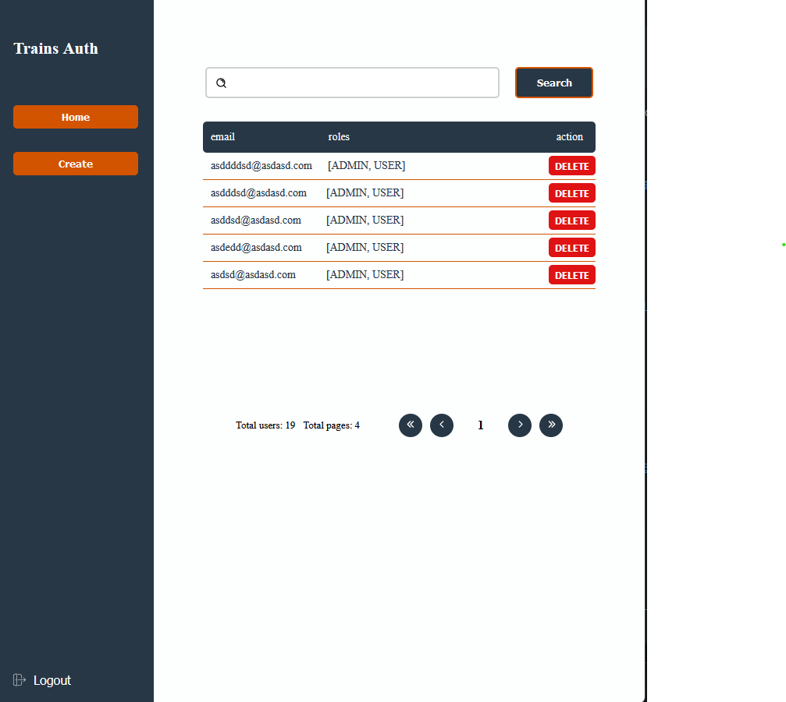
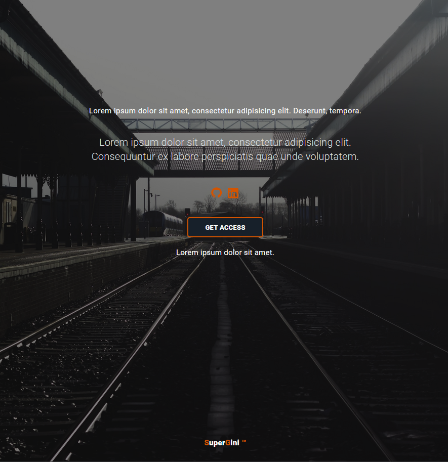
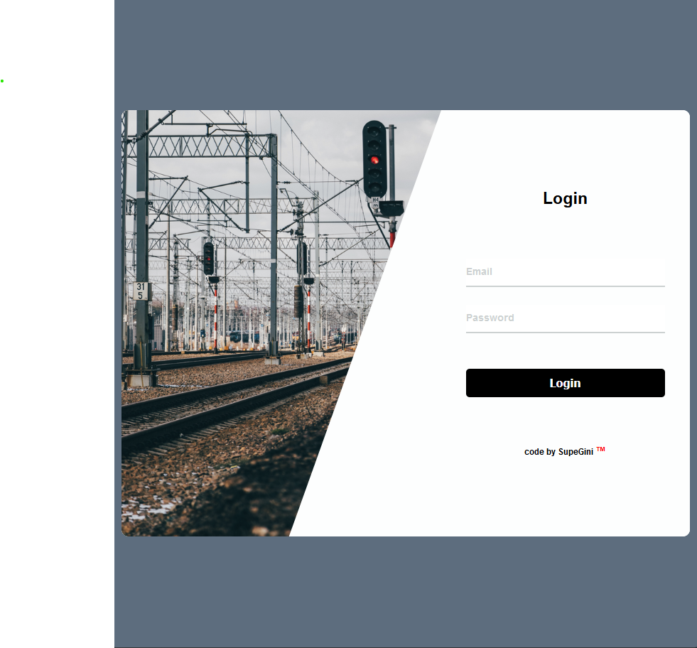
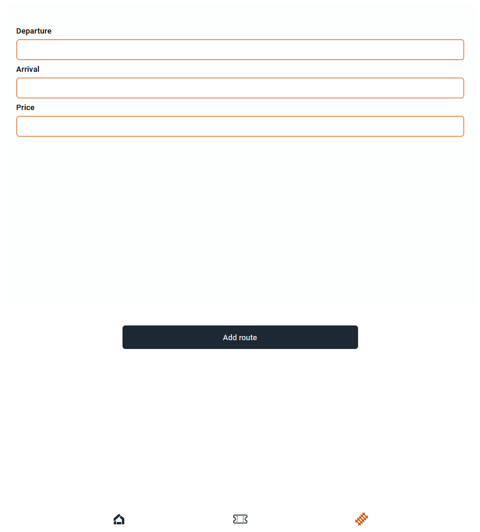
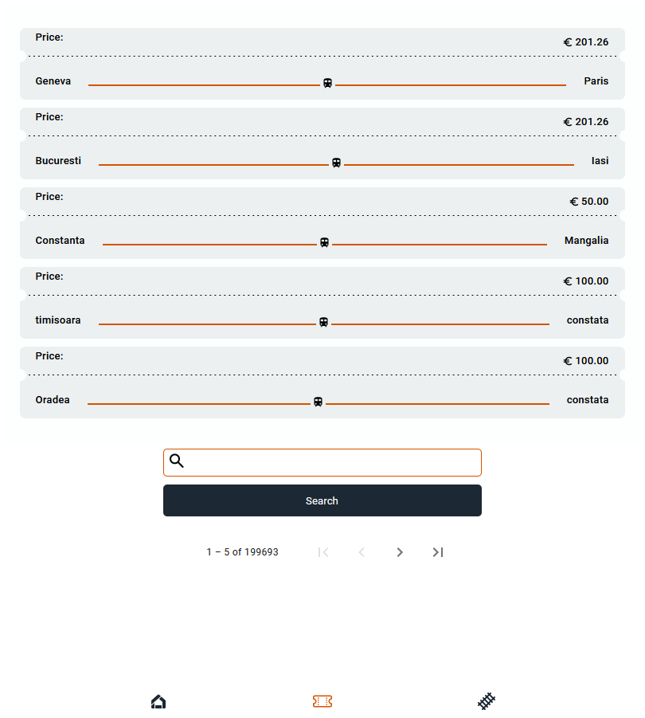
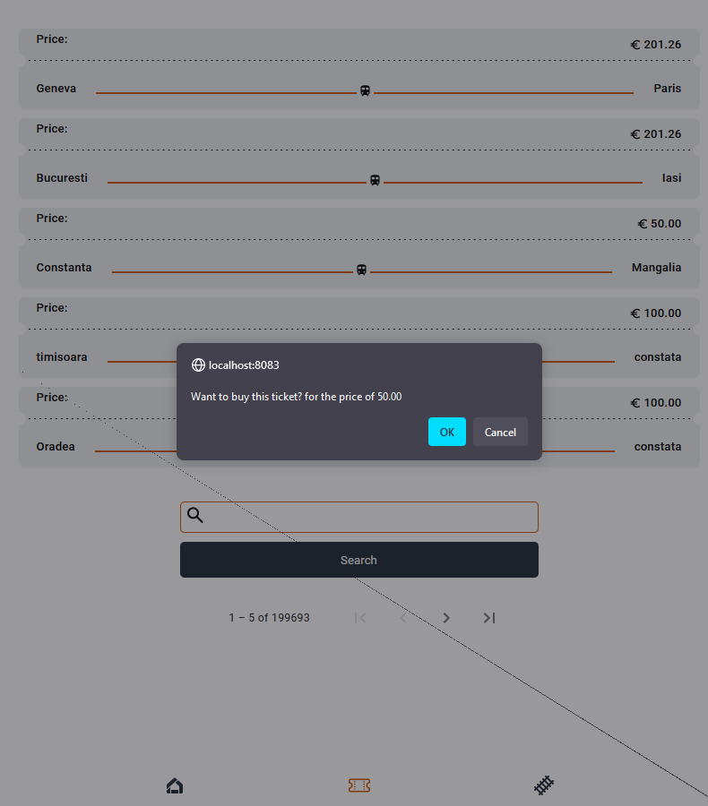
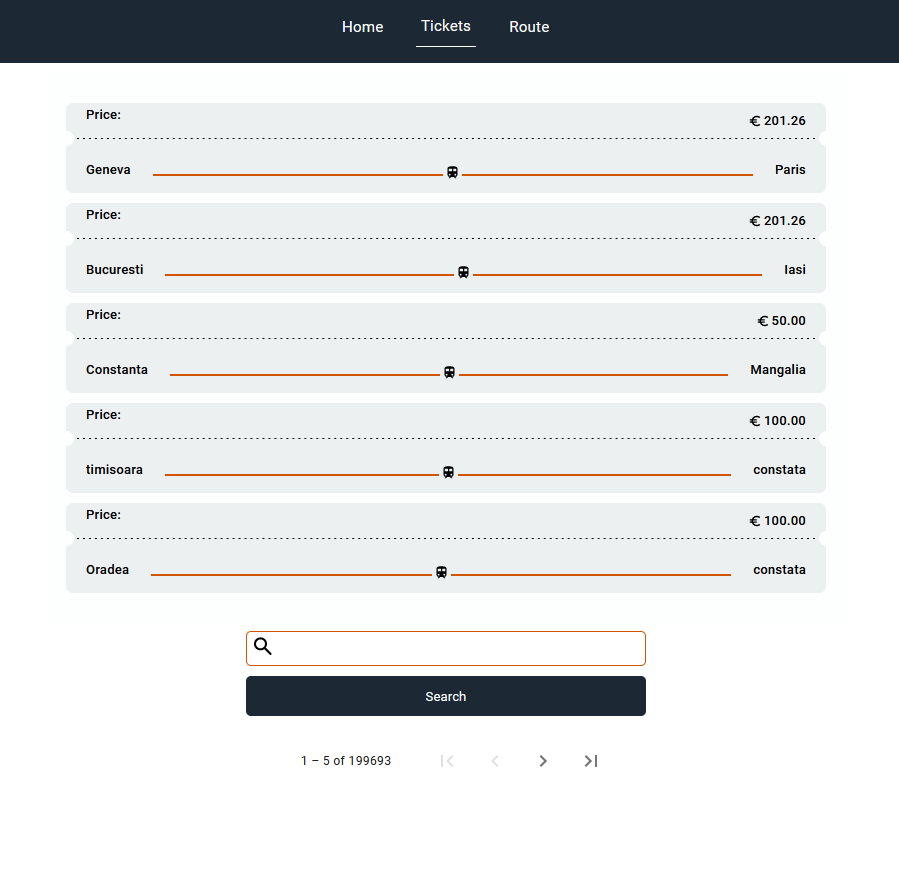

# Full stack trains scheduler app

 

## Frameworks & Technologies

- ![SpringBoot] ![SpringBootVersion]
- ![Spring] ![SpringVersion]
- ![Hibernate] ![HibernateVersion]
- ![Angular] ![AngularVersion]
- ![HTMX]
- ![HTML]
- ![CSS]
- ![MySQL]

## Presentation

[SpringBoot]: https://img.shields.io/static/v1?style=for-the-badge&message=Spring+Boot&color=6DB33F&logo=Spring+Boot&logoColor=FFFFFF&label=
[Spring]: https://img.shields.io/static/v1?style=for-the-badge&message=Spring&color=6DB33F&logo=Spring&logoColor=FFFFFF&label=
[SpringVersion]: https://img.shields.io/badge/6.1-orange
[HTMX]: https://img.shields.io/static/v1?style=for-the-badge&message=htmx&color=3366CC&logo=htmx&logoColor=FFFFFF&label=
[SpringBootVersion]: https://img.shields.io/badge/3.2.0-orange
[Angular]: https://img.shields.io/badge/Angular-DD0031?style=for-the-badge&logo=angular&logoColor=white
[AngularVersion]: https://img.shields.io/badge/17-orange
[Hibernate]: https://img.shields.io/static/v1?style=for-the-badge&message=Hibernate&color=59666C&logo=Hibernate&logoColor=FFFFFF&label
[HibernateVersion]: https://img.shields.io/badge/6.3.1-orange
[HTML]: https://img.shields.io/static/v1?style=for-the-badge&message=HTML5&color=E34F26&logo=HTML5&logoColor=FFFFFF&label=
[CSS]: https://img.shields.io/static/v1?style=for-the-badge&message=CSS3&color=1572B6&logo=CSS3&logoColor=FFFFFF&label=
[MySQL]: https://img.shields.io/static/v1?style=for-the-badge&message=MySQL&color=4479A1&logo=MySQL&logoColor=FFFFFF&label=

